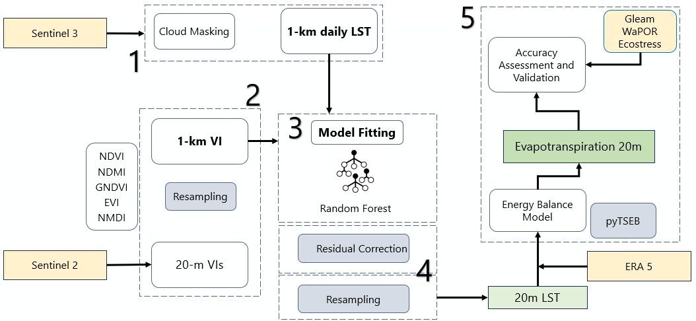

## Sentinel 3 LST downscaling and ET estimation

Based on the review of state-of-the-art methods  to estimate ET using Sentinel-3 the following processing chain was developed for LST downscaling and ET estimation. The process includes three steps: downscaling of Sentinel-3 LST, TSEB ET and validation. ERA5 meteorological data and STRM DEM were used as an input.
In this repository, the downscaling of Sentinel-3 SLSTR LST data was performed as shown in the below figure. The Sentinel-3 images are acquired via CDSE cloud platform (Sentinel-3_LST.ipynb). After masking the pixels covered by cloud, 1-km daily LST images were prepared as input to a machine learning model. The model was trained using 5 spectral indices (i.e., predictors) resampled to 1-km, including NDVI, NDMI, GNDVI, EVI, and NMDI, generated by Sentinel-2 images at 20m spatial resolution (Sentinel-2_VIs.ipynb). Hence, the input of model includes 1-km LST and Sentinel-2 indices. After training a random forest classifier (LST_Downscaling.ipynb), the model predicts 20-m cropland pixels of Sentinel-2 indices mosaic. Indeed, the trained model was employed by 1-km data to find out the relationship of LST values to indices. Afterwards, the model, structured by those relationships, was utilized to predict 20-m LST values. Additionally, the residuals of model were resampled to 20-m to correct the predictions.

For the ET estimation, an approach based on the pyTSEB library (ET_Estimation.ipynb) was used to estimate ET using processed LST images and ERA5 data. The input parameters of the model are divided into two groups (i) directly imported from Sentinel-2, -3, and ERA5 and (ii) intermediate variables calculated using pyTSEB. 
The final output of the processor is 20m resolution ET for available timesteps of Sentinel-3, which is calculated based on the latent heat flux output and converted to mm/day scale as GeoTiff files.
